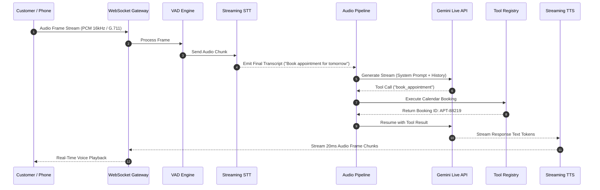
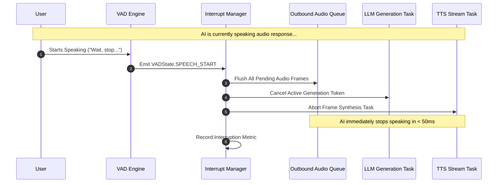

# Production Real-Time Conversational Voice AI Platform

[](https://github.com/Kartikp1608/conversational-voice-bot/actions/workflows/ci.yml)
[](https://github.com/Kartikp1608/conversational-voice-bot)
[](https://github.com/psf/black)
[](https://github.com/astral-sh/ruff)
[](http://mypy-lang.org/)

A high-performance, low-latency, full-duplex conversational Voice AI engine built with **Python 3.10+ / 3.12 / 3.13**, **FastAPI**, **WebSockets**, **Gemini 2.5 Flash Live API**, **Deepgram Streaming STT / TTS**, and **Google Cloud Speech / Text-to-Speech**.

Engineered to match enterprise platforms like **ElevenLabs Conversational AI**, **Retell AI**, **Bland AI**, and **Vapi**, achieving sub-800ms end-to-end response latency with real-time barge-in interruption handling, dynamic state machines, pluggable tool calling, and prompt-driven business logic.

---

## 🚀 Key Features

* **Sub-800ms Latency Pipeline**: Asynchronous streaming token generation, parallelized Speech-To-Text (STT) interim recognition, and chunked Text-To-Speech (TTS) audio streaming.
* **Full-Duplex Interruption & Barge-In**: Real-time VAD detection immediately halts AI audio playback, flushes output audio frame queues, and cancels active LLM generation on user speech.
* **Dual Direction Telephony**: Native support for both **Outbound Calling** and **Inbound Calling** via Twilio Media Streams and generic SIP/WebRTC audio gateways.
* **Zero-Code Prompt Engine**: Entire business workflows (Sales, Healthcare, Banking, Customer Support, Lead Qualification) configured exclusively via standard YAML/JSON prompt specifications. No code changes required.
* **Explicit State Machine**: Formally managed conversation state transitions (`GREETING` -> `VERIFICATION` -> `BUSINESS_LOGIC` -> `TOOL_EXECUTION` -> `CONFIRMATION` -> `CLOSING`).
* **Pluggable Tool Execution**: Asynchronous plugin engine supporting CRM lookups, Calendar scheduling, Database queries, SMS/Email/WhatsApp messaging, and REST Webhooks.
* **Enterprise Telemetry**: Integrated Prometheus metric exposition, structured JSON logging with context-propagated call IDs, and OpenTelemetry distributed tracing.
* **Reproducible & Offline Testable**: 100% runnable test suite with mock providers and in-memory SQLite requiring zero external API keys.

---

## 📐 Architecture Diagram

```mermaid
graph TD
    Client[Web Client / Telephony Gateway] <-->|Full-Duplex WS| WSG[WebSocket Gateway]
    
    subgraph Voice Gateway Engine
        WSG <--> StreamMgr[Audio Stream Manager]
        StreamMgr --> Filter[DSP Noise Filter]
        Filter --> VAD[VAD & Turn Detection Engine]
    end

    subgraph Pipeline Orchestration
        VAD -->|Audio Frames| STT[Streaming STT Provider]
        STT -->|Interim/Final Transcripts| IntMgr[Interrupt Manager & Barge-in]
        IntMgr -->|Trigger Interruption| Cancellation[Instant Audio Queue Flush & LLM Cancel]
        IntMgr -->|User Transcript| ConvMgr[Conversation Manager]
        ConvMgr <-->|System Prompt & State| PromptEng[Prompt Engine & YAML Config]
        ConvMgr <-->|Turn Buffer & Entities| Memory[Short Term & RAG Memory]
        ConvMgr -->|Stream Token Request| LLM[Gemini 2.5 Flash Live API / LLM Provider]
        LLM -->|Tool Call Request| Tools[Tool Registry & Execution Plugins]
        Tools -->|Tool Result| LLM
        LLM -->|Token Stream| TTS[Streaming TTS Provider]
        TTS -->|PCM Audio Frames| StreamMgr
    end

    subgraph Persistence & Observability
        ConvMgr -->|State & Transcripts| DB[(Async SQLite / PostgreSQL)]
        Pipeline Orchestration -->|Telemetry| Metrics[Prometheus & Structured Logs]
    end
```

---

## ⏱ Call Flow & Interruption Sequence Diagrams

### 1. Inbound / Outbound Call Flow



### 2. Barge-in Interruption Handling



---

## 🏁 Quickstart & Installation

### 1. Clone Repository & Setup Virtual Environment
```bash
git clone https://github.com/Kartikp1608/conversational-voice-bot.git
cd conversational-voice-bot

python3 -m venv venv
source venv/bin/activate
```

### 2. Install Dependencies
Install exact pinned dependencies or development tools:
```bash
# Production install with locked versions:
pip install -r requirements-lock.txt

# Or development install:
pip install -r requirements.txt -r requirements-dev.txt
```

### 3. Configure Environment Variables
Copy `.env.example` to `.env`:
```bash
cp .env.example .env
```

To run completely offline with mock providers (no API keys needed), leave `LLM_PROVIDER=mock`, `STT_PROVIDER=mock`, and `TTS_PROVIDER=mock`.

---

## 🛠 Configuration Guide

All environment variables supported in `.env`:

| Variable | Type | Default | Description |
| :--- | :--- | :--- | :--- |
| `APP_NAME` | String | `VoiceAI Platform` | Service title |
| `APP_ENV` | String | `development` | Environment (`development`, `production`, `testing`) |
| `DEBUG` | Boolean | `true` | FastAPI reload mode |
| `PORT` | Integer | `8000` | HTTP/WebSocket listening port |
| `HOST` | String | `0.0.0.0` | Bind host address |
| `TARGET_MAX_LATENCY_MS` | Float | `800.0` | End-to-end latency SLA target |
| `LLM_PROVIDER` | String | `mock` | `mock` or `gemini_live` |
| `STT_PROVIDER` | String | `mock` | `mock`, `deepgram`, or `google` |
| `TTS_PROVIDER` | String | `mock` | `mock`, `deepgram`, or `google` |
| `GEMINI_API_KEY` | String | Optional | Google Gemini API Key |
| `VERTEX_PROJECT_ID` | String | `ml-odio` | GCP Project ID |
| `DEEPGRAM_API_KEY` | String | Optional | Deepgram API Key for STT/TTS |
| `DATABASE_URL` | String | `sqlite+aiosqlite:///./voice_ai.db` | Async database URI |
| `TWILIO_ACCOUNT_SID` | String | Optional | Twilio account SID for telephony |
| `TWILIO_AUTH_TOKEN` | String | Optional | Twilio authentication token |
| `TWILIO_PHONE_NUMBER` | String | `+18005550199` | Caller ID phone number |

---

## 🧪 Testing & Quality Assurance

The codebase includes an extensive unit and integration test suite with coverage enforcement (>84% coverage across all modules).

### Run Test Suite with Coverage
```bash
pytest -v --cov=. --cov-report=term-missing
```

### Run Code Formatter & Linters
```bash
# Check formatting with Black
black --check .

# Lint with Ruff
ruff check .

# Type checking with Mypy
mypy .
```

---

## 📁 Repository Structure

```
conversational-voice-bot/
├── .github/
│   ├── workflows/ci.yml     # Automated CI pipeline (lint, type-check, test, coverage)
│   └── dependabot.yml       # Automated dependency updates
├── api/                     # FastAPI app, routes, webhooks, WebSockets
│   ├── routes/              # Health, Calls, Webhooks, Prompts, WebSockets
│   └── main.py              # Server entrypoint and lifecycle hooks
├── voice_gateway/           # Real-time WebSocket audio pipeline & session management
│   ├── audio_pipeline.py    # Core <800ms STT -> VAD -> LLM -> TTS orchestrator
│   ├── session_manager.py   # Active call session tracking
│   └── stream_manager.py    # Jitter buffer and audio frame packetization
├── llm/                     # Gemini 2.5 Flash Live & Mock LLM providers
├── stt/                     # Deepgram Streaming, Google Cloud & Mock STT providers
├── tts/                     # Deepgram Aura, Google Cloud & Mock TTS providers
├── conversation/            # State Machine & Conversation Manager
├── prompt_engine/           # Dynamic YAML system prompt builder
├── prompts/                 # Sample business workflows (Sales, Healthcare, Support, Banking)
├── tool_executor/           # Async tool plugin engine (CRM, Calendar, DB, SMS, Webhook)
├── interruptions/           # Real-time barge-in detector & audio buffer flush
├── vad/                     # Voice Activity Detection engine
├── noise_filter/            # DSP Noise Gate and DC Offset filter
├── memory/                  # Short term turn buffer, context summarizer, RAG retriever
├── analytics/               # Real-time latency tracking (TTFT, End-to-End, STT/TTS)
├── database/                # SQLAlchemy 2.0 Async ORM models & repositories
├── monitoring/              # Prometheus metrics & OpenTelemetry tracer
├── utils/                   # Audio codecs (PCM/Mulaw), framing, cancellation tokens
├── tests/                   # 75+ automated unit & integration test specs (>84% coverage)
├── .env.example             # Documented environment configuration template
├── pyproject.toml           # Tooling configurations (Ruff, Black, Mypy, Pytest, Coverage)
├── requirements.txt         # Production dependencies
├── requirements-dev.txt     # Development and testing dependencies
├── requirements-lock.txt    # Pinned dependency lockfile
├── Dockerfile               # Production multi-stage Docker build
└── docker-compose.yml       # Container deployment configuration
```

---

## 🐳 Docker Deployment

### Local Run using Uvicorn
```bash
python -m uvicorn api.main:app --host 0.0.0.0 --port 8000
```

### Docker Build & Run
```bash
docker build -t voice_ai_platform .
docker run -d -p 8000:8000 --env-file .env voice_ai_platform
```

### Docker Compose
```bash
docker-compose up -d --build
```

---

## 🌐 API Documentation

FastAPI automatic interactive documentation is available at:
* Swagger UI: `http://localhost:8000/docs`
* ReDoc: `http://localhost:8000/redoc`
* Prometheus Metrics: `http://localhost:8000/metrics`

### Trigger Outbound Call
```bash
curl -X POST "http://localhost:8000/api/v1/calls/outbound" \
     -H "Content-Type: application/json" \
     -d '{
           "to_phone_number": "+15550199",
           "prompt_id": "sales_outbound"
         }'
```

---

## 📄 License
Production Voice AI Platform codebase — Built for low-latency conversational AI applications.

