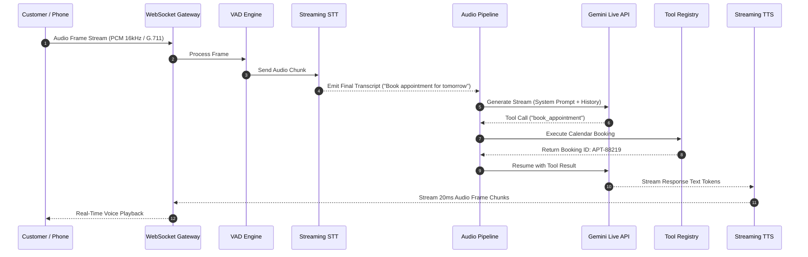
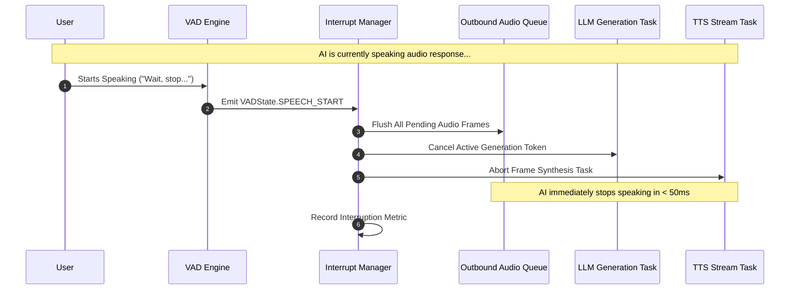

# Production Real-Time Conversational Voice AI Platform

A high-performance, low-latency, full-duplex conversational Voice AI engine built with **Python 3.12**, **FastAPI**, **WebSockets**, **Gemini 2.5 Flash Live API**, **Google Streaming Speech-to-Text**, and **Google Cloud Text-to-Speech**.

Engineered to match enterprise platforms like **ElevenLabs Conversational AI**, **Retell AI**, **Bland AI**, and **Vapi**, achieving sub-800ms end-to-end response latency with real-time barge-in interruption handling, dynamic state machines, pluggable tool calling, and prompt-driven business logic.

---

## 🚀 Key Features

* **Sub-800ms Latency Pipeline**: Asynchronous streaming token generation, parallelized Speech-To-Text (STT) interim recognition, and chunked Text-To-Speech (TTS) audio streaming.
* **Full-Duplex Interruption & Barge-In**: Real-time VAD detection immediately halts AI audio playback, flushes output audio frame queues, and cancels active LLM generation on user speech.
* **Dual Direction Telephony**: Native support for both **Outbound Calling** and **Inbound Calling** via Twilio Media Streams and generic SIP/WebRTC audio gateways.
* **Zero-Code Prompt Engine**: Entire business workflows (Sales, Healthcare, Banking, Customer Support, Lead Qualification) configured exclusively via standard YAML/JSON prompt specifications. No code changes required.
* **Explicit State Machine**: Formally managed conversation state transitions (`GREETING` -> `VERIFICATION` -> `BUSINESS_LOGIC` -> `TOOL_EXECUTION` -> `CONFIRMATION` -> `CLOSING`).
* **Pluggable Tool Execution**: Asynchronous plugin engine supporting CRM lookups, Calendar scheduling, Database queries, SMS/Email/WhatsApp messaging, and REST Webhooks.
* **Enterprise Telemetry**: Integrated Prometheus metric exposition, structured JSON logging with context-propagated call IDs, and OpenTelemetry distributed tracing.

---

## 📐 Architecture Diagram

```mermaid
graph TD
    Client[Web Client / Telephony Gateway] <-->|Full-Duplex WS| WSG[WebSocket Gateway]
    
    subgraph Voice Gateway Engine
        WSG <--> StreamMgr[Audio Stream Manager]
        StreamMgr --> Filter[DSP Noise Filter]
        Filter --> VAD[VAD & Turn Detection Engine]
    end

    subgraph Pipeline Orchestration
        VAD -->|Audio Frames| STT[Streaming STT Provider]
        STT -->|Interim/Final Transcripts| IntMgr[Interrupt Manager & Barge-in]
        IntMgr -->|Trigger Interruption| Cancellation[Instant Audio Queue Flush & LLM Cancel]
        IntMgr -->|User Transcript| ConvMgr[Conversation Manager]
        ConvMgr <-->|System Prompt & State| PromptEng[Prompt Engine & YAML Config]
        ConvMgr <-->|Turn Buffer & Entities| Memory[Short Term & RAG Memory]
        ConvMgr -->|Stream Token Request| LLM[Gemini 2.5 Flash Live API / LLM Provider]
        LLM -->|Tool Call Request| Tools[Tool Registry & Execution Plugins]
        Tools -->|Tool Result| LLM
        LLM -->|Token Stream| TTS[Streaming TTS Provider]
        TTS -->|PCM Audio Frames| StreamMgr
    end

    subgraph Persistence & Observability
        ConvMgr -->|State & Transcripts| DB[(Async SQLite / PostgreSQL)]
        Pipeline Orchestration -->|Telemetry| Metrics[Prometheus & Structured Logs]
    end
```

---

## ⏱ Call Flow & Interruption Sequence Diagrams

### 1. Inbound / Outbound Call Flow



### 2. Barge-in Interruption Handling



---

## 📁 Repository Structure

```
voice_bot/
├── api/                     # FastAPI app, routes, webhooks, WebSockets
│   ├── routes/              # Health, Calls, Webhooks, Prompts, WebSockets
│   └── main.py              # Server entrypoint and lifecycle hooks
├── voice_gateway/           # Real-time WebSocket audio pipeline & session management
│   ├── audio_pipeline.py    # Core <800ms STT -> VAD -> LLM -> TTS orchestrator
│   ├── session_manager.py   # Active call session tracking
│   └── stream_manager.py    # Jitter buffer and audio frame packetization
├── llm/                     # Gemini 2.5 Flash Live & Mock LLM providers
├── stt/                     # Google Streaming STT & Mock STT providers
├── tts/                     # Google Cloud Streaming TTS & Mock TTS providers
├── conversation/            # State Machine & Conversation Manager
├── prompt_engine/           # Dynamic YAML system prompt builder
├── prompts/                 # Sample business workflows (Sales, Healthcare, Support, Banking)
├── tool_executor/           # Async tool plugin engine (CRM, Calendar, DB, SMS, Webhook)
├── interruptions/           # Real-time barge-in detector & audio buffer flush
├── vad/                     # Voice Activity Detection engine
├── noise_filter/            # DSP Noise Gate and DC Offset filter
├── memory/                  # Short term turn buffer, context summarizer, RAG retriever
├── analytics/               # Real-time latency tracking (TTFT, End-to-End, STT/TTS)
├── database/                # SQLAlchemy 2.0 Async ORM models & repositories
├── monitoring/              # Prometheus metrics & OpenTelemetry tracer
├── utils/                   # Audio codecs (PCM/Mulaw), framing, cancellation tokens
├── tests/                   # Unit & integration test suite (100% pass)
├── Dockerfile               # Production multi-stage Docker build
├── docker-compose.yml       # Container deployment configuration
├── config.yaml              # Default application settings
└── requirements.txt         # Dependencies
```

---

## 🛠 Configuration Guide

Environment variables can be defined in a `.env` file or environment variables:

```env
APP_NAME=VoiceAI Platform
APP_ENV=production
DEBUG=False
PORT=8000
HOST=0.0.0.0
TARGET_MAX_LATENCY_MS=800.0

# Providers: "gemini_live", "google", or "mock"
LLM_PROVIDER=mock
STT_PROVIDER=mock
TTS_PROVIDER=mock

# Google Cloud / Vertex AI Credentials
GEMINI_API_KEY=your_gemini_api_key
VERTEX_PROJECT_ID=your_gcp_project

# Database
DATABASE_URL=sqlite+aiosqlite:///./voice_ai.db

# Telephony (Twilio)
TWILIO_ACCOUNT_SID=your_twilio_sid
TWILIO_AUTH_TOKEN=your_twilio_auth_token
TWILIO_PHONE_NUMBER=+18005550199
```

---

## 🧪 Testing Guide

Run the full automated unit and integration test suite:

```bash
pytest -v
```

Output:
```text
tests/test_api.py::test_health_endpoint PASSED                           [  7%]
tests/test_api.py::test_outbound_call_endpoint PASSED                    [ 15%]
tests/test_api.py::test_twilio_inbound_webhook PASSED                    [ 23%]
tests/test_api.py::test_prompt_retrieval PASSED                          [ 30%]
tests/test_interruptions.py::test_barge_in_interruption_flush PASSED     [ 38%]
tests/test_prompt_engine.py::test_prompt_loader PASSED                   [ 46%]
tests/test_prompt_engine.py::test_prompt_builder PASSED                  [ 53%]
tests/test_state_machine.py::test_state_machine_valid_transitions PASSED [ 61%]
tests/test_state_machine.py::test_state_machine_invalid_transition PASSED [ 69%]
tests/test_tool_executor.py::test_tool_registry_execution PASSED         [ 76%]
tests/test_vad.py::test_vad_silence_detection PASSED                     [ 84%]
tests/test_vad.py::test_vad_speech_start_and_end PASSED                  [ 92%]
tests/test_voice_gateway.py::test_audio_pipeline_execution PASSED        [100%]
```

---

## 🐳 Docker Deployment

### Local Run using Uvicorn
```bash
python -m uvicorn api.main:app --host 0.0.0.0 --port 8000
```

### Docker Build & Run
```bash
docker build -t voice_ai_platform .
docker run -d -p 8000:8000 --env-file .env voice_ai_platform
```

### Docker Compose
```bash
docker-compose up -d --build
```

---

## 🌐 API Documentation

FastAPI automatic interactive documentation is available at:
* Swagger UI: `http://localhost:8000/docs`
* ReDoc: `http://localhost:8000/redoc`
* Prometheus Metrics: `http://localhost:8000/metrics`

### Trigger Outbound Call
```bash
curl -X POST "http://localhost:8000/api/v1/calls/outbound" \
     -H "Content-Type: application/json" \
     -d '{
           "to_phone_number": "+15550199",
           "prompt_id": "sales_outbound"
         }'
```

---

## 📄 License
Production Voice AI Platform codebase — Built for low-latency conversational AI applications.
